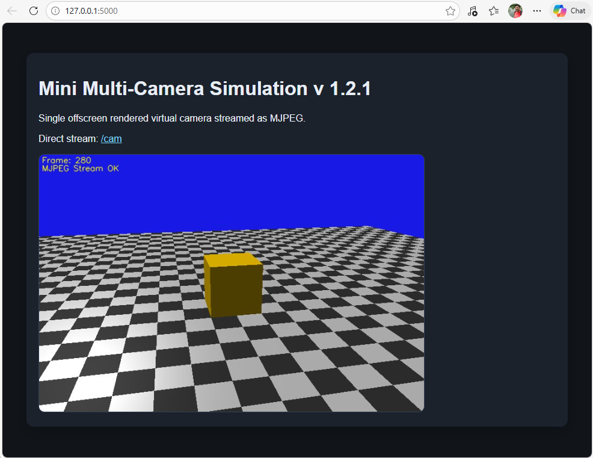
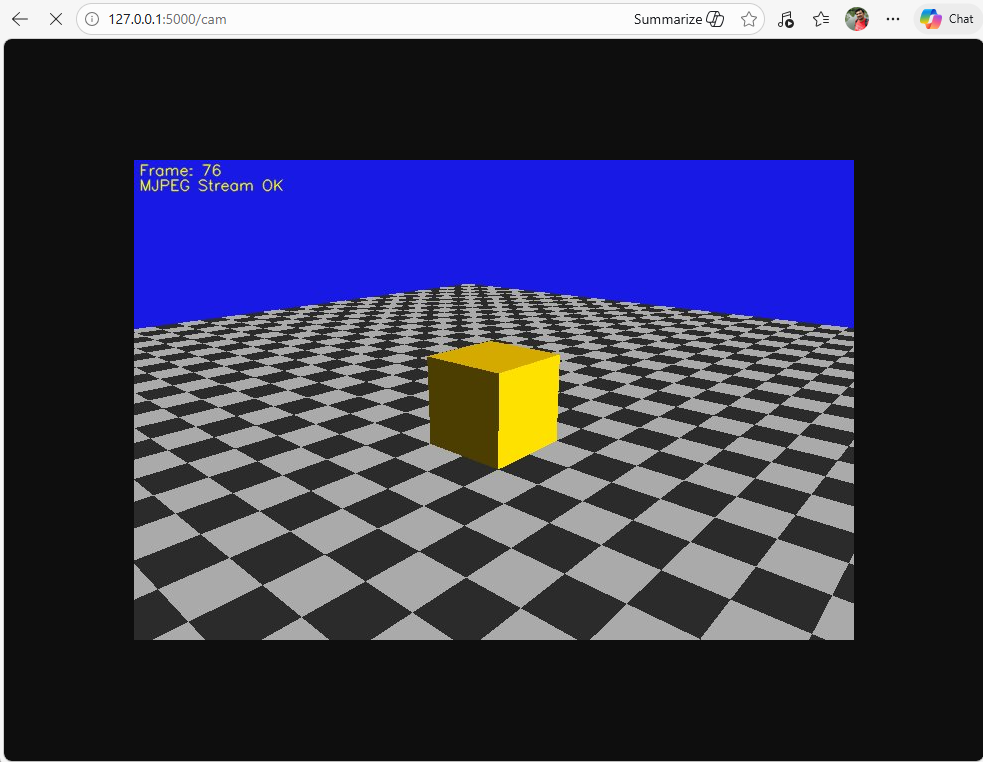

# Multi-Camera Simulation Engine

[](https://www.python.org/downloads/)
[](https://www.opengl.org/)
[](https://flask.palletsprojects.com/)
[](https://opensource.org/licenses/MIT)

A high-performance, Python-based offscreen 3D camera simulation engine. It renders a virtual scene with a rotating camera using OpenGL and publishes the result as a real-time MJPEG IP camera stream, designed specifically for imaging system simulation experiments and computer vision testing.



---

## 📌 Overview

The **Multi-Camera Simulation Engine** provides a lightweight virtual environment for researchers and developers to simulate complex imaging systems. By leveraging thread-safe offscreen rendering and MJPEG streaming, it provides a "virtual" IP camera feed that can be consumed by standard video clients or computer vision pipelines without requiring a physical camera or a visible UI.

### 🌟 Project Vision & Background
This project was conceived to demonstrate the feasibility of high-fidelity imaging system simulation tools, particularly for consumer hardware products. It aligns with advanced industry workflows involving:
- **System Design & Validation**: Defining simulation capabilities and performance goals to validate against real hardware.
- **Multi-Camera R&D**: Investigating imaging performance goals and spatial configurations for multi-camera systems (including XR applications).
- **Cross-Functional Collaboration**: Bridging the gap between Product Design (PD), Electrical Engineering (EE), Camera Hardware, and Software teams through early-stage virtual prototyping.

This repository represents the **beginning of a medium-to-large scale open-source project** aimed at providing accessible, professional-grade simulation tools for the computer vision and hardware engineering communities.

### Key Applications
- **Computer Vision Development**: Validate tracking and detection algorithms against ground-truth controlled virtual environments.
- **Imaging System R&D**: Simulate varying camera parameters (FOV, resolution, placement) before physical deployment.
- **Robotics & XR Simulation**: Provide low-latency visual feedback for autonomous agent training and augmented reality testing.

## 🚀 Key Features

- **Real-time 3D Rendering**: High-performance rendering via OpenGL 3.3+ with Phong shading (ambient, diffuse, specular) and directional lighting.
- **Thread-Safe Offscreen Pipeline**: Uses hidden GLFW windows and custom Framebuffer Objects (FBOs) for background rendering, optimized for multi-threaded Flask environments.
- **MJPEG IP Camera Stream**: Efficiently broadcasts rendered frames over HTTP, mimicking a real network-attached camera.
- **Dynamic Orbit Camera**: Configurable virtual camera with adjustable FOV, near/far planes, and procedural orbit logic.
- **Procedural Scene Elements**: Includes a built-in ground plane with checkerboard textures for spatial reference and a central cube.
- **Modular Architecture**: Clean separation between core logic, rendering, streaming, and web interfaces for easy extensibility.

## 📁 Project Structure

```text
Multi-Camera-Simulation-Engine/
├── config/             # Application and camera configuration (settings.json)
├── core/               # Orchestration and state management
│   ├── app.py          # Main application orchestrator (MultiCamSimApp)
│   └── state.py        # Settings loader and global state management
├── doc/                # Documentation assets and diagrams
├── effects/            # Post-processing and image effect hooks
├── render/             # OpenGL rendering engine
│   ├── camera.py       # Camera view and projection logic
│   └── renderer.py     # OpenGL context, shaders, and geometry management
├── stream/             # Video broadcasting components
│   └── mjpeg_stream.py # MJPEG encoding and HTTP streaming logic
├── utils/              # General utility helpers
├── web/                # Flask web interface
│   ├── routes.py       # API and stream endpoints
│   ├── static/         # CSS/JS assets
│   └── templates/      # Dashboard UI (index.html)
├── main.py             # Application entry point
└── requirements.txt    # Project dependencies
```

## 🛠️ Installation & Setup

### Prerequisites
- **Python 3.8+**
- **OpenGL 3.3+** compatible graphics hardware
- **GLFW** library (usually handled via `glfw` python package, but requires system-level OpenGL drivers)

### 1. Clone the Repository
```bash
git clone https://github.com/your-username/Multi-Camera-Simulation-Engine.git
cd Multi-Camera-Simulation-Engine
```

### 2. Prepare Environment
```bash
# Create and activate virtual environment
python -m venv venv
source venv/bin/activate  # Linux/macOS
# or
venv\Scripts\activate     # Windows
```

### 3. Install Dependencies
```bash
pip install -r requirements.txt
```

## 🚀 Quick Start

Launch the engine with a single command:

```bash
python main.py
```

Once running, the engine starts a local Flask server:
- **Web Dashboard**: [http://localhost:5000](http://localhost:5000)
- **Direct MJPEG Stream**: [http://localhost:5000/cam](http://localhost:5000/cam)

### Live Stream Preview
When you access the direct stream or the web dashboard, you will see the real-time offscreen rendered view:


*(Note: Example of the real-time rotating camera feed served via MJPEG over HTTP)*

## ⚙️ Configuration

The engine is highly customizable via `config/settings.json`. The file is automatically generated with defaults on the first run.

### Default Configuration Schema (v1.2.1)
```json
{
  "version": "1.2.1",
  "app": {
    "host": "127.0.0.1",
    "port": 5000,
    "fps": 30,
    "width": 720,
    "height": 480
  },
  "camera": {
    "radius": 8.0,
    "height": 3.5,
    "angular_speed_deg": 20.0,
    "target": [0.0, 0.5, 0.0],
    "fov_deg": 45.0,
    "near": 0.1,
    "far": 100.0
  },
  "light": {
    "position": [6.0, 8.0, 6.0]
  }
}
```

## 🧠 Technical Architecture

The Multi-Camera Simulation Engine is built around a modular architecture to ensure scalability:

- **`MultiCamSimApp` (`core/app.py`)**: The central orchestrator. It initializes the `AppState`, `Renderer`, and `MjpegStreamer` and registers the web routes.
- **`AppState` (`core/state.py`)**: Manages global application state and loads configuration from `settings.json`.
- **`Renderer` (`render/renderer.py`)**: The heart of the 3D visualization. It handles:
    - **GLFW Context Management**: Initializes a hidden GLFW window and manages the OpenGL context, crucial for thread-safe rendering in a multi-threaded Flask environment.
    - **Shader Program**: Compiles GLSL vertex and fragment shaders for Phong shading, enabling realistic lighting (ambient, diffuse, specular) and object coloring (including a checkerboard ground plane).
    - **Geometry Buffers**: Sets up Vertex Array Objects (VAOs), Vertex Buffer Objects (VBOs), and Element Buffer Objects (EBOs) for rendering 3D objects.
    - **Framebuffer Object (FBO)**: Renders directly to an off-screen framebuffer, allowing the rendered image to be read back into a NumPy array without displaying a window.
- **`MjpegStreamer` (`stream/mjpeg_stream.py`)**: Responsible for encoding rendered frames into MJPEG format and serving them over HTTP using OpenCV and Flask Response.

## 🚧 Limitations & Future Work

### Current Limitations
- **Single Camera Stream**: Currently, the engine supports one active camera stream at a time.
- **Basic Scene**: The 3D scene is currently limited to a cube and a ground plane.
- **Passive Interface**: The web dashboard is read-only; no interactive controls for the camera are available yet.

### Future Enhancements
- **Multi-Camera Support**: Simultaneous rendering and streaming of multiple virtual cameras.
- **Model Loading**: Support for loading complex 3D models (OBJ, GLTF).
- **Interactive UI**: Real-time controls for camera movement, FOV, and lighting parameters via the web dashboard.
- **Post-Processing**: Integration of image effects (noise, lens distortion, color correction).
- **Plugin System**: Formal plugin system for adding new rendering effects or camera types.
- **REST API**: Programmatic control of simulation parameters via a dedicated API.

## 🤝 Contributing

Contributions are welcome! Whether it's adding support for multiple cameras, improving the UI, or implementing new post-processing effects.

1. Fork the Project
2. Create your Feature Branch (`git checkout -b feature/AmazingFeature`)
3. Commit your Changes (`git commit -m 'Add some AmazingFeature'`)
4. Push to the Branch (`git push origin feature/AmazingFeature`)
5. Open a Pull Request

## 📄 License

Distributed under the MIT License. See `LICENSE` for more information.

# Author

**Sayed Ahmadreza Razian, PhD**

LinkedIn\
https://www.linkedin.com/in/ahmadrezarazian/

Google Scholar\
https://scholar.google.com/citations?user=Dh9Iy2YAAAAJ

Email\
AhmadrezaRazian@gmail.com

Feel free to contact me for collaboration or questions.

---
*Developed for advanced imaging system simulation and computer vision research.*
